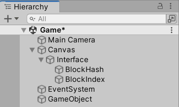
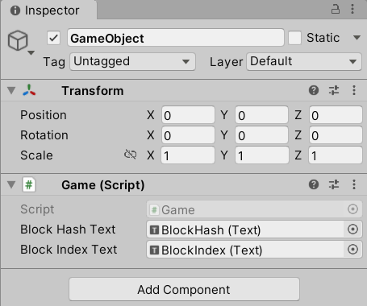
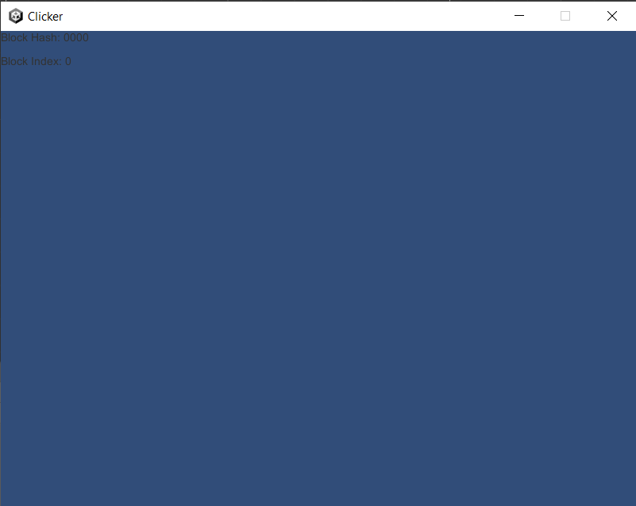

# Basic Node

In this section, we will create a simple [Unity] application that
does the following:

- Run a local blockchain node.
- As the node mines and appends `Block`s, show ths changes in the blockchain's
  tip[^1].


## Creating a Unity Project

First and foremost, install [Unity Hub] first[^2].  Once finished,
open [Unity Hub] and from `Installs` → `Install Editor`, install
Unity Editor version `2021.3.0f1`[^3].  After Unity Editor installation is done,
go to `Projects` and select `New Project`.  From the `New Project` screen,
select `2D Core`, select a location to save your project, and name it `Clicker`.
Once everything is set up, click on `Create Project` and wait for
Unity Editor window to show up.


## Importing [UniLibplanet] Unity Package

Download the latest [UniLibplanet.unitypackage][UniLibplanet releases] from
the [UniLibplanet] [GitHub] repository.  From Unity Editor,
select `Assets` → `Import Package` → `Custom Pakcage` from the top menu
and select the downloaded [UniLibplanet.unitypackage] file.  Confirm with
`Import` to import everything.


## Basic UI

As the application will be running on top of a blockchain, our first objective
is to render the state of the blockchain itself on a screen.  We will be
creating a basic UI to draw the `Hash` and the `Index` of the tip of
the blockchain in real time.  For this, we create the following UI components:

- Text showing the `Hash` of the blockchain's tip.
- Text showing the `Index` of the blockchain's tip.

### Running in Background

As a blockchain node, we need to make sure that the application isn't paused
while in background.  Otherwise, UI update together with mining and/or block
syncing process will hang when the application window is not in focus,
and generally this is not how we would want a blockchain node to behave.
Under the Unity Editor's menu, navigate to `Edit` → `Project Settings`
→ `Player` and make sure `Run In Background` option is enabled.

### Creating a Scene

Perform the following step by step in Unity Editor:

- Set up a scene:
  - Navigate to `Assets/Scenes` directory in Unity Editor inside
    the **Project** panel.  There should be `SampleScene` already inside.
    Rename `SampleScene` to `Game`.
  - Double click on the `Game` scene to activate it.  Once
    activated, `Game` should show inside the **Hierarchy** panel.
- Change the background color:
  - Select `Main Camera` and inside the **Inspector** panel, change
    the background color to something lighter as texts will be in black.
- Create a new canvas:
  - Right click on `Game` inside the **Hierarchy** panel and select
    `GameObject` → `UI` → `Canvas`.
  - Select `Canvas` inside the **Hierarchy** panel.
  - Inside the **Inspector** panel, set `Render Mode` to
    `Screen Space - Camera`, drag and drop `Main Camera` from the **Hierarchy**
    panel to the box next to `Render Camera`, and set `UI Scale Mode`
    to `Scale With Screen Size`.
  - Right click on `Canvas` inside the **Hierarchy** panel and select
    `Properties`.  Select `Add Component` from the properties window and select
    `Layout` → `Horizontal Layout Group`.
- Create an interface:
  - Right click on `Canvas` inside the **Hierarchy** panel and select
    `Create Empty` to create a `GameObject`.  Rename the newly created
    `GameObject` as `Interface`.
  - Inside the **Scene** panel, drag and resize the `Interface` rectangle
    to fill the `Canvas`.
  - Right click on `Interface` inside the **Hierarchy** panel and select
    `UI` → `Legacy` → `Text` twice to create two `Text` objects.  Name them as
    `Block Hash` and `Block Index`.
  - Drag objects around inside the scene panel so they do not overlap.
- Create a game object:
  - Right click on `Game` inside the **Hierarchy** panel and select
    `Create Empty` to create a `GameObject`.

When finished, the **Hierarchy** panel should look something like below.



### Initial UI Script

Create a file named `Game.cs` under `Assets/Scripts` with
the following content:

```csharp
using UnityEngine;
using UnityEngine.UI;

namespace Scripts
{
    public class Game : MonoBehaviour
    {
        public Text BlockHashText;
        public Text BlockIndexText;

        public void Awake()
        {
            BlockHashText.text = "Block Hash: 0000";
            BlockIndexText.text = "Block Index: 0";
        }
    }
}
```

### Connecting UI to the Script

Finally, we connect the script above to the UI using the following steps:

- Select `GameObject` from the **Hierarchy** panel.
- Inside the **Inspector** panel, select `Add Component` → `Scripts` →
  `Scripts` → `Game`.
- Inside the **Inspector** panel, under `Game` component, you should see
  `Block Hash Text`, `Block Index Text`; drag and drop text objects from
  the **Hierarchy** panel to each corresponding box accordingly.

When done, the **Inspector** panel for `GameObject` should look like below.



Try `Build and Run` from Unity Editor.  If everything was done accordingly,
you should see `Block Hash: 0000` and `Block Index: 0` on your screen.




## Rendering `Block`s

Now, let's try to run a blockchain node.  Update the content of `Game.cs`
we already have created previously with the following:

```csharp
using System.Collections.Generic;
using Libplanet.Action;
using Libplanet.Blocks;
using Libplanet.Blockchain.Renderers;
using Libplanet.Unity;
using UnityEngine;
using UnityEngine.UI;
using UnityEngine.Events;

namespace Scripts
{
    // Unity event handler.
    public class BlockUpdatedEvent : UnityEvent<Block<PolymorphicAction<ActionBase>>>
    {
    }

    public class Game : MonoBehaviour
    {
        // Connected to UI elements.
        public Text BlockHashText;
        public Text BlockIndexText;

        private BlockUpdatedEvent _blockUpdatedEvent;
        private IEnumerable<IRenderer<PolymorphicAction<ActionBase>>> _renderers;
        private Agent _agent;

        // Unity MonoBehaviour Awake().
        public void Awake()
        {
            // General application settings.
            Screen.SetResolution(800, 600, FullScreenMode.Windowed);
            Application.SetStackTraceLogType(LogType.Log, StackTraceLogType.ScriptOnly);

            // Register a listener.
            _blockUpdatedEvent = new BlockUpdatedEvent();
            _blockUpdatedEvent.AddListener(UpdateBlockTexts);

            // Renderers are called when certain conditions are met.
            // There are different types of renderers called under different conditions.
            // Some are called when a new block is added, some are called when an action is executed.
            _renderers = new List<IRenderer<PolymorphicAction<ActionBase>>>()
            {
                new AnonymousRenderer<PolymorphicAction<ActionBase>>()
                {
                    BlockRenderer = (oldTip, newTip) =>
                    {
                        // FIXME: For a genesis block, this renderer can get called
                        // while Libplanet's internal BlockChain object is not
                        // fully initialized.  This is a haphazard way to bypass
                        // NullReferenceException getting thrown.
                        if (newTip.Index > 0)
                        {
                            _agent.RunOnMainThread(() => _blockUpdatedEvent.Invoke(newTip));
                        }
                    }
                }
            };

            // Initialize a Libplanet Unity Agent.
            _agent = Agent.AddComponentTo(gameObject, _renderers);
        }

        // Unity MonoBehaviour Start().
        public void Start()
        {
            // Initialize texts.
            BlockHashText.text = "Block Hash: 0000";
            BlockIndexText.text = "Block Index: 0";
        }

        // Updates block texts.
        private void UpdateBlockTexts(Block<PolymorphicAction<ActionBase>> tip)
        {
            BlockHashText.text = $"Block Hash: {tip.Hash.ToString().Substring(0, 4)}";
            BlockIndexText.text = $"Block Index: {tip.Index}";
        }
    }
}
```

In order for an application to react to a blockchain level event, such as
a change in the tip of the local blockchain and/or created actions
getting executed, the application needs to pass a set of callback methods
for an `Agent` to call.  These are called renderers and must implement
the `IRenderer` interface.

In the example above, when the tip of the blockchain changes, the
blockchain calls the method

```csharp
BlockRenderer = (oldTip, newTip) =>
{
    if (newTip.Index > 0)
    {
        _agent.RunOnMainThread(() => _blockUpdatedEvent.Invoke(newTip));
    }
}
```

where it is picked up by `UpdateBlockTexts()` method as it was added as
a listener to `_blockUpdatedEvent` in the previous part of the code.

For now, just note `Agent` is simply a wrapper class for handling a [Libplanet]
blockchain node.  Also don't worry about `PolymorphicAction<ActionBase>`
for now.  This will be explained further later.


## Running a Blockchain Node

In order to run a [Libplanet] blockchain node, the following three are needed:

- A genesis block: This is the very first block of a blockchain.  Only nodes
  with the same genesis block can properly communicate with each other.
- A swarm configuration: A `json` file that determines the behavior of a node,
  This is outside the scope of this tutorial.
- A private key: This determines the identity of a node.  All transactions
  created and all blocks mined will be signed using this private key.

These three files can be easily created using Unity Editor menu.  Create each
using `Create genesis block`, `Create swarm config`, and `Create private key`
under `Tools` → `Libplanet`.

Now, you can build and run the application. If you see the `Block Hash` text
and the `Block Index` text on your screen updating periodically, then you
are now running a blockchain node!


At first, block index might be going up rather fast, but after a while,
the blockchain will adjust accordingly and slow down.


<!-- footnotes -->

----

### Footnotes

[^1]: The tip of a blockchain is a `Block` with the highest `Index`.

[^2]: This tutorial is written with [Unity Hub] 3.1.2.

[^3]: At this moment, only Unity Editor version 2021.3.0f1 is supported.


<!-- links -->

[GitHub]: https://github.com/
[Libplanet]: https://github.com/planetarium/libplanet
[Unity]: https://unity.com/
[Unity Hub]: https://unity3d.com/get-unity/download
[UniLibplanet]: https://github.com/planetarium/UniLibplanet
[UniLibplanet releases]: https://github.com/planetarium/UniLibplanet/releases
