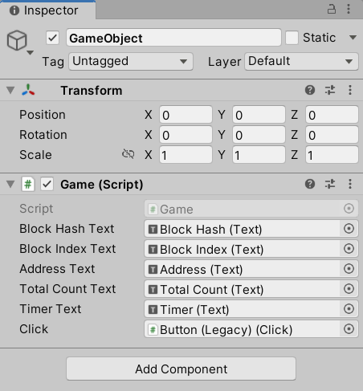
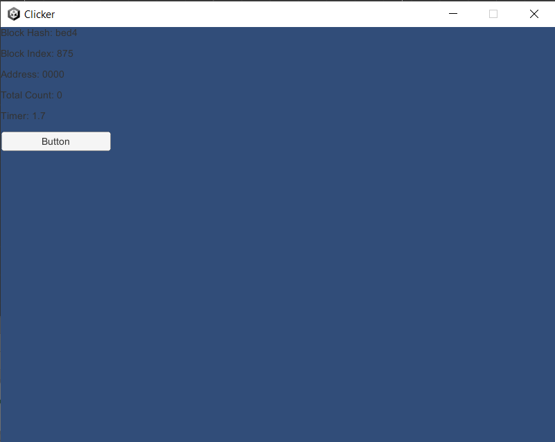

# Click Counter

Now that we know how to run a basic blockchain node, in this part
of the tutorial, we add an interactive element to the application:

- Count the number of times `Button` is pressed every cycle that is
  3 seconds long.
- At the end of a cycle, if `Button` was pressed during the cycle,
  create a transaction containing a `ClickAction` action with a count
  and reset the timer.
- Have blocks mined containing transactions, if any[^1].
- Have mined blocks added to the local blockchain.
- Update the UI counting the total number of clicks once `ClickAction` actions
  are evaluated by the local blockchain.


## Click Counter UI

### New UI Elements

To see how many clicks are registered to a blockchain, we create additional
UI elements using the following steps:

- Inside the **Hierarchy** panel, right click on `Interface` and select
  `UI` → `Legacy` → `Text` three times.  Name them each as `Address`,
  `Total Count`, and `Timer`.
- Again, right click on `Interface` inside the **Hierarchy** panel and
  select `UI` → `Legacy` → `Button` to create a button.
- Drag objects around inside the scene panel so they do not overlap.


### New UI Scripts

Create a file named `Click.cs` under `Assets/Scripts` with
the following content:

```csharp
using UnityEngine;

namespace Scripts
{
    public class Click : MonoBehaviour
    {
        public int Count { get; set; } = 0;

        public void Add()
        {
            Count++;
        }

        public void ResetCount()
        {
            Count = 0;
        }
    }
}
```

Also create a file named `Timer.cs` under `Assets/Scripts` with
the following content:

```csharp
using UnityEngine;

namespace Scripts
{
    public class Timer
    {
        public const float Period = 3.0f;

        public float Clock { get; set; } = 0.0f;

        public void Tick()
        {
            Clock -= Time.deltaTime;
        }

        public void ResetTimer()
        {
            Clock = Period;
        }
    }
}
```

Now update the `Game.cs` file with the following content:

```csharp
using System.Collections.Generic;
using Libplanet.Action;
using Libplanet.Blocks;
using Libplanet.Blockchain.Renderers;
using Libplanet.Unity;
using UnityEngine;
using UnityEngine.UI;
using UnityEngine.Events;

namespace Scripts
{
    // Unity event handler.
    public class BlockUpdatedEvent : UnityEvent<Block<PolymorphicAction<ActionBase>>>
    {
    }

    public class Game : MonoBehaviour
    {
        // Connected to UI elements.
        public Text BlockHashText;
        public Text BlockIndexText;
        public Text AddressText;
        public Text TotalCountText;
        public Text TimerText;
        public Click Click;

        private BlockUpdatedEvent _blockUpdatedEvent;
        private IEnumerable<IRenderer<PolymorphicAction<ActionBase>>> _renderers;
        private Agent _agent;
        private Timer _timer;

        // Unity MonoBehaviour Awake().
        public void Awake()
        {
            // General application settings.
            Screen.SetResolution(800, 600, FullScreenMode.Windowed);
            Application.SetStackTraceLogType(LogType.Log, StackTraceLogType.ScriptOnly);

            // Register a listener.
            _blockUpdatedEvent = new BlockUpdatedEvent();
            _blockUpdatedEvent.AddListener(UpdateBlockTexts);

            // Renderers are called when certain conditions are met.
            // There are different types of renderers called under different conditions.
            // Some are called when a new block is added, some are called when an action is executed.
            _renderers = new List<IRenderer<PolymorphicAction<ActionBase>>>()
            {
                new AnonymousRenderer<PolymorphicAction<ActionBase>>()
                {
                    BlockRenderer = (oldTip, newTip) =>
                    {
                        // FIXME: For a genesis block, this renderer can get called
                        // while Libplanet's internal BlockChain object is not
                        // fully initialized.  This is a haphazard way to bypass
                        // NullReferenceException getting thrown.
                        if (newTip.Index > 0)
                        {
                            _agent.RunOnMainThread(() => _blockUpdatedEvent.Invoke(newTip));
                        }
                    }
                }
            };

            // Initialize a Libplanet Unity Agent.
            _agent = Agent.AddComponentTo(gameObject, _renderers);

            // Initialize a Timer.
            _timer = new Timer();
        }

        // Unity MonoBehaviour Start().
        public void Start()
        {
            // Initialize texts.
            BlockHashText.text = "Block Hash: 0000";
            BlockIndexText.text = "Block Index: 0";
            AddressText.text = "Address: 0000";
            TotalCountText.text = "Total Count: 0";
            TimerText.text = "Timer: 0.0";
            _timer.ResetTimer();
        }

        // Unity MonoBehaviour FixedUpdate().
        public void FixedUpdate()
        {
            _timer.Tick();
            if (_timer.Clock <= 0)
            {
                _timer.ResetTimer();
            }
            TimerText.text = $"Timer: {_timer.Clock:F1}";
        }

        // Updates block texts.
        private void UpdateBlockTexts(Block<PolymorphicAction<ActionBase>> tip)
        {
            BlockHashText.text = $"Block Hash: {tip.Hash.ToString().Substring(0, 4)}";
            BlockIndexText.text = $"Block Index: {tip.Index}";
        }
    }
}
```

There isn't much change to `Game.cs` other than having some texts and a simple
timer getting added.

### Connecting UI to Scripts

Again, we connect the scripts above to the UI using the following steps:

- Select `Button` from the **Hierarchy** panel.  Inside the **Inspector** panel,
  select `Add Component` → `Scripts` → `Scripts` → `Click` to register
  `Click.cs` to the button.
  - There should be an `On Click ()` field inside the **Inspector** panel.
  - Select `+` to add to the list.  Then drag and drop `Button` object
    from the **Hierarchy** panel to the newly created element under `On Click ()`.
  - Change `No Function` to `Click` → `Add ()`.
- Select `GameObject` from the **Hierarchy** panel.
  - Inside the **Inspector** panel, under `Game` component, you should see
    additional elements.  Just like before, drag and drop text and button
    objects from the **Hierarchy** panel to each corresponding box accordingly.



Try running the application again to see if everything is working fine
up to this point.




## Actions and States

Three componenets are needed to create an action for a [Libplanet] blockchain
to consume:

- Action itself.
- Arguments for an action.  This is stored on **Blockchain** store.
- Output for an action.  This is stored on **State** store.

An action is any [C#] object implementing an `IAction` interface.
Since we can't directly record a [C#] object to a blockchain,
when we say an action is recorded on a blockchain, what it technically means
is its arguments, together with its name to identify which action took place,
is written.

As a result of executing an action, i.e. being recorded on a blockchain,
changes the game state by writing the output of the action to a stored state.

In both cases, data is encoded in [Bencodex] format.

### State `CountState`

In order to store the total number of clicks for a player, we essentially
wrap `long` inside a class called `CountState` that inherits `DataModel`.
Create a new file named `CountState.cs` under `Assets/Scripts/States/`
with the following content.

```csharp
using Libplanet.Store;

namespace Scripts.States
{
    public class CountState : DataModel
    {
        public long Count { get; private set; }

        // Used for creating a new state.
        public CountState(long count)
            : base()
        {
            Count = count;
        }

        // Used for deserializing a stored state.
        // This must be declared as base constructor cannot be inherited.
        public CountState(Bencodex.Types.Dictionary encoded)
            : base(encoded)
        {
        }

        // Used for adding `count` to the current state.
        public CountState AddCount(long count)
        {
            return new CountState(Count + count);
        }
    }
}
```

As all data recorded on blockchain and the state storage in [Bencodex] format,
the `DataModel` class is there to help with all the heavy lifting of encoding
and decoding behind the scenes.

Although strictly not necessary, due to distributed nature of blockchain
technology, it is recommended to use immutability as much as possible since
it is **extremely hard** to roll back changes if blockchain data gets
corrupted for whatever reason.

### Plain value `ClickActionPlainValue`

In order to store the number of clicks for an action, its arguments should also
be encoded in [Bencodex] format.  For this purpose, similar to `CountState`,
we need to wrap `long` inside a class called `ClickActionPlainValue`.
Create a new file named `ClickActionPlainValue.cs` under
`Assets/Scripts/Actions/` with the following content.

```csharp
using Libplanet.Store;

namespace Scripts.Actions
{
    public class ClickActionPlainValue : DataModel
    {
        public long Count { get; private set; }

        public ClickActionPlainValue(long count)
            : base()
        {
            Count = count;
        }

        // Used for deserializing stored action.
        public ClickActionPlainValue(Bencodex.Types.Dictionary encoded)
            : base(encoded)
        {
        }
    }
}
```

Although there doesn't seem to be much of a difference between `CountState`
and `ClickActionPlainValue` classes, the two have completely different
uses and it is **highly advisable** to have these to be separate.

### Action `ClickAction`

Now create a file named `ClickAction.cs` under `Assets/Scripts/Actions`
with the following content for `ClickAction` action.

```csharp
using System;
using Libplanet.Action;
using Libplanet.Unity;
using Scripts.States;
using UnityEngine;

namespace Scripts.Actions
{
    // Used for reflection when deserializing a stored action.
    [ActionType("click_action")]
    public class ClickAction : ActionBase
    {
        private ClickActionPlainValue _plainValue;

        // Used for reflection when deserializing a stored action.
        public ClickAction()
        {
        }

        // Used for creating a new action.
        public ClickAction(long count)
        {
            _plainValue = new ClickActionPlainValue(count);
        }

        // Used for serialzing an action.
        public override Bencodex.Types.IValue PlainValue => _plainValue.Encode();

        // Used for deserializing a stored action.
        public override void LoadPlainValue(Bencodex.Types.IValue plainValue)
        {
            if (plainValue is Bencodex.Types.Dictionary bdict)
            {
                _plainValue = new ClickActionPlainValue(bdict);
            }
            else
            {
                throw new ArgumentException(
                    $"Invalid {nameof(plainValue)} type: {plainValue.GetType()}");
            }
        }

        // Executes an action.
        // This is what gets called when a block containing an action is mined
        // or appended to a blockchain.
        public override IAccountStateDelta Execute(IActionContext context)
        {
            // Retrieves the previously stored state.
            IAccountStateDelta states = context.PreviousStates;
            CountState countState =
                states.GetState(context.Signer) is Bencodex.Types.Dictionary countStateEncoded
                    ? new CountState(countStateEncoded)
                    : new CountState(0L);

            // Mutates the loaded state, logs the result, and stores the resulting state.
            long prevCount = countState.Count;
            countState = countState.AddCount(_plainValue.Count);
            long nextCount = countState.Count;
            Debug.Log($"click_action: PrevCount: {prevCount}, NextCount: {nextCount}");
            return states.SetState(context.Signer, countState.Encode());
        }
    }
}
```

As can be seen in the comments above, most of the code above is to automate
serialization and deserialization.  Pay special attention to the `Execute()`
method where the main logic of the action resides.

Note that `Execute()` is called when the action is evaluated by a blockchain,
**not** when the button is clicked or when the action is created at the
end of a `Timer` cycle.


## Updated `Game.cs`

Now to tie everything together, once again, update the content of `Game.cs`
with the following:

```csharp
using System.Collections.Generic;
using Libplanet.Action;
using Libplanet.Blocks;
using Libplanet.Blockchain.Renderers;
using Libplanet.Unity;
using UnityEngine;
using UnityEngine.UI;
using UnityEngine.Events;
using Scripts.Actions;
using Scripts.States;

namespace Scripts
{
    // Unity event handlers.
    public class BlockUpdatedEvent : UnityEvent<Block<PolymorphicAction<ActionBase>>>
    {
    }

    public class TotalCountUpdatedEvent : UnityEvent<CountState>
    {
    }

    public class Game : MonoBehaviour
    {
        // Connected to UI elements.
        public Text BlockHashText;
        public Text BlockIndexText;
        public Text AddressText;
        public Text TotalCountText;
        public Text TimerText;
        public Click Click;

        private BlockUpdatedEvent _blockUpdatedEvent;
        private TotalCountUpdatedEvent _totalCountUpdatedEvent;
        private IEnumerable<IRenderer<PolymorphicAction<ActionBase>>> _renderers;
        private Agent _agent;
        private Timer _timer;

        // Unity MonoBehaviour Awake().
        public void Awake()
        {
            // General application settings.
            Screen.SetResolution(800, 600, FullScreenMode.Windowed);
            Application.SetStackTraceLogType(LogType.Log, StackTraceLogType.ScriptOnly);

            // Register listeners.
            _blockUpdatedEvent = new BlockUpdatedEvent();
            _blockUpdatedEvent.AddListener(UpdateBlockTexts);
            _totalCountUpdatedEvent = new TotalCountUpdatedEvent();
            _totalCountUpdatedEvent.AddListener(UpdateTotalCountText);

            // Renderers are called when certain conditions are met.
            // There are different types of renderers called under different conditions.
            // Some are called when a new block is added, some are called when an action is executed.
            _renderers = new List<IRenderer<PolymorphicAction<ActionBase>>>()
            {
                new AnonymousRenderer<PolymorphicAction<ActionBase>>()
                {
                    BlockRenderer = (oldTip, newTip) =>
                    {
                        // FIXME: For a genesis block, this renderer can get called
                        // while Libplanet's internal BlockChain object is not
                        // fully initialized.  This is a haphazard way to bypass
                        // NullReferenceException getting thrown.
                        if (newTip.Index > 0)
                        {
                            _agent.RunOnMainThread(() => _blockUpdatedEvent.Invoke(newTip));
                        }
                    }
                },
                new AnonymousActionRenderer<PolymorphicAction<ActionBase>>()
                {
                    ActionRenderer = (action, context, nextStates) =>
                    {
                        // Invoke the event handler only if the state is updated.
                        if (nextStates.GetState(context.Signer) is Bencodex.Types.Dictionary bdict)
                        {
                            _agent.RunOnMainThread(() => _totalCountUpdatedEvent.Invoke(new CountState(bdict)));
                        }
                    }
                }
            };

            // Initialize a Libplanet Unity Agent.
            _agent = Agent.AddComponentTo(gameObject, _renderers);

            // Initialize a Timer.
            _timer = new Timer();
        }

        // Unity MonoBehaviour Start().
        public void Start()
        {
            // Initialize texts.
            BlockHashText.text = "Block Hash: 0000";
            BlockIndexText.text = "Block Index: 0";

            AddressText.text = $"My Address: {_agent.Address.ToHex().Substring(0, 4)}";
            Bencodex.Types.IValue initialState = _agent.GetState(_agent.Address);
            Debug.Log($"init state is null: {initialState is null}");
            if (initialState is Bencodex.Types.Dictionary bdict)
            {
                _totalCountUpdatedEvent.Invoke(new CountState(bdict));
            }
            else
            {
                _totalCountUpdatedEvent.Invoke(new CountState(0L));
            }

            _timer.ResetTimer();
            TimerText.text = $"Timer: {_timer.Clock:F1}";
        }

        // Unity MonoBehaviour FixedUpdate().
        public void FixedUpdate()
        {
            _timer.Tick();

            // If timer clock reaches zero, count the number of clicks so far
            // and create a transaction containing an action with the click count.
            // Afterwards, reset the timer and the count.
            if (_timer.Clock <= 0)
            {
                if (Click.Count > 0)
                {
                    // ActionBase to PolymorphicAction Casting is done automagically.
                    List<PolymorphicAction<ActionBase>> actions =
                        new List<PolymorphicAction<ActionBase>>()
                        {
                            new ClickAction(Click.Count)
                        };
                    _agent.MakeTransaction(actions);
                }

                Click.ResetCount();
                _timer.ResetTimer();
            }

            // Update timer text.
            TimerText.text = $"Timer: {_timer.Clock:F1}";
        }

        // Update block texts.
        private void UpdateBlockTexts(Block<PolymorphicAction<ActionBase>> tip)
        {
            BlockHashText.text = $"Block Hash: {tip.Hash.ToString().Substring(0, 4)}";
            BlockIndexText.text = $"Block Index: {tip.Index}";
        }

        // Update total count text.
        private void UpdateTotalCountText(CountState countState)
        {
            TotalCountText.text = $"Total Count: {countState.Count}";
        }
    }
}
```

There are a few things that are worthy of note here.  Firstly, a different type
of `IRenderer`, an `ActionRenderer` as opposed to a `BlockRenderer`,
is additionally used this time.  This is because we want the rendering event
to happen when the `IAction` is executed, not when the `Block` containing
the said `IAction` is appended.  As a `Block` can contain multiple
`IAction`s, there is a subtle difference.

Secondly, inside `FixedUpdate()` method, we convert our own `ClickAction` type
to `PolymorphicAction<ActionBase>>` before passing on to the `Agent` when
creating a `Transaction`.

```csharp
List<PolymorphicAction<ActionBase>> actions =
    new List<PolymorphicAction<ActionBase>>()
    {
        new ClickAction(Click.Count)
    };
_agent.MakeTransaction(actions);
```

As hinted in the comments previously at several places,
the `PolymorphicAction<ActionBase>` class takes care of most of
the encoding/decoding process automatically behind the scenes, which is why
it is used rather extensively.  Otherwise, we would have to directly implement
encoding and decoding methods for every action that we create.

Build and run once again to see your button presses get registered to
a blockchain.


If everything went smoothly, now you have an application that can record
states with `IAction`s on a blockchain!


<!-- footnotes -->

----

### Footnotes

[^1]: Blocks will be mined regardless of whether there are any transactions
      to mine or not.


<!-- links -->

[Bencodex]: https://github.com/planetarium/bencodex
[C#]: https://docs.microsoft.com/en-us/dotnet/csharp
[Libplanet]: https://github.com/planetarium/libplanet
