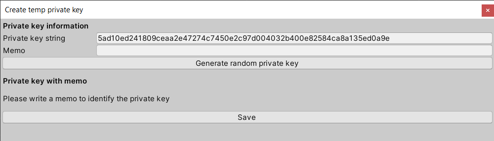

# Multiple Nodes

**Disclaimer: This section is still work in progress.  This section does
not work with the current release version 0.5.0 of [UniLibplanet].**

The application building part for `Clicker` is mostly done by this point.
Provided with a right configuration, `Clicker` already can act as a
blockchain node when run.  We just need to test if two different nodes
can communicate with each other and that a node can sync up to a different node
on the shared network if necessary.

For this part of the tutorial, we will be assuming you have access to at least
two computers sharing a local area network.


## Seed Node

As a "normal" user try to start running his/her own node, it needs to know
where to connect **initially** in order to join an existing blockchain network.
A seed node of a network is a node that can act as an entry point for such
other node that is trying to join the network.  In general, this information
needs to be known before the application is distributed.

For this, we will setup a blockchain network in such a way that the client
binary on the computer that you have been using to develop the `Clicker`
application will be running as a seed node.

### Generate `BoundPeer` String

[Libplanet] uses what is called `BoundPeer` to manage peer to peer connections.
Each `BoundPeer` has its special string format, that is of the form
`<public_key>,<dns_end_point>,<port>`, which can be directly handled
by [Libplanet].  We need to somehow generate this string first.
First, under Unity Editor's menu, select `Tools` → `Libplanet` → `Private key`
→ `Open private key file location` to open up a folder containing a private key.
There should be a file named `private_key`.  This is just a text file without
an extension, so open it with any text editor to see what is inside.
Copy the hexadecimal string found inside the file to the clipboard.

Now go back to Unity Editor, and under its menu, select `Tools` → `Libplanet` →
`Utils` → `Generate bound peer string` to open up a window for generating a
`BoundPeer` string.  Paste the private key you have copied into a field next
to `Private key string`.

Let's suppose your development machine has a local IP address of `192.168.1.123`
and you want to use `12345` as the communicating port.  Enter `192.168.1.123`
into a field next to `Host` and `12345` next to `Port`.

If all fields are valid, you should see a generated `BoundPeer` string appear.
Drag and copy it to the clipboard.


### Edit Distributed `swarm_config.json`

Now open up the `swarm_config.json` file inside the `StreamingAssets` directory
and edit the `SeedPeers` property to include the `BoundPeer` string from above:

```json
"SeedPeers": [
    "0245bd692dd49aa5bee3664c9d5198b9fe6feade22780eab4e0c5da89c6a52d090,192.168.1.123,12345"
],
```

Build the application again.  There should be a copy of `swarm_config.json`
file inside your build directory under `Clicker_Data/StreamingAssets`.
Make sure `SeedPeers` is not empty[^1].


## Additional Preparation

If you have an additional computer ready, now is the time to copy the build
directory to a computer that will act as a non-seed node.  You may place
the copied directory anywhere you like.  For convenience, we will refer to
the seed node computer as `Node A` and the non-seed node computer as `Node B`.

Edit `Node A`'s `swarm_config.json` so that its `Host` and `Port` matches
that of the `BoundPeer` string.

```json
"Host": "192.168.1.123",
"Port": 12345,
```

Edit `Node B`'s `swarm_config.json` to match its local IP address,
say `192.168.1.234`, and use the same port as that of `Node A`'s[^2].

```json
"Host": "192.168.1.234",
"Port": 12345,
```

As mentioned in [Basic Node] section, we need three files for `Node B` to run,
namely `genesis_block`, `swarm_config.json`, and `private_key`.  As both
`genesis_block` and `swarm_config.json` are distributed as a part of
the build, we need to create a `private_key` file for `Node B`.  Using
Unity Editor, under `Tools` -> `Libplanet` -> `Private keys` -> `Create temp
private key`.  Select `Generate random private key` to generate a random
private key.



Create a new file named `private_key` anywhere on your computer and copy-paste
the private key string into the file and save.  Move the `private_key` file
just created to `Node B` under `%APPDATA%/../LocalLow/DefaultCompany/Clicker`.

In a production environment, you might want to make it so that the game client
and/or its launcher provide a way to automate this process.


## Running Multiple Nodes

Now we just need to run both binaries on `Node A` and `Node B`.  It is
important to note that a seed node must be running first.  Run `Node A`'s
`Clicker.exe` first, then wait a while, and run `Node B`'s `Clicker.exe`.
Now you can click the buttons on both computers and see the `ScoreBoard`
reflect the counts from both nodes!


<!-- footnotes -->

----

### Footnotes

[^1]: As with any computer program, it is not unreasonable to expect there
      to be some unexpected down time for any node.  Therefore, it is
      recommended to have multiple seed nodes ready for a production
      environment.

[^2]: Technically, for any non-seed node, any usable port is fine, as the node
      will be announcing its listening port.  This is not the case for seed
      nodes, as other non-seed nodes need to have a **fixed point of entry**
      to the blockchain network.


<!-- links -->

[Libplanet]: https://github.com/planetarium/libplanet
[UniLibplanet]: https://github.com/planetarium/UniLibplanet
[Basic Node]: ./basic_node.md
