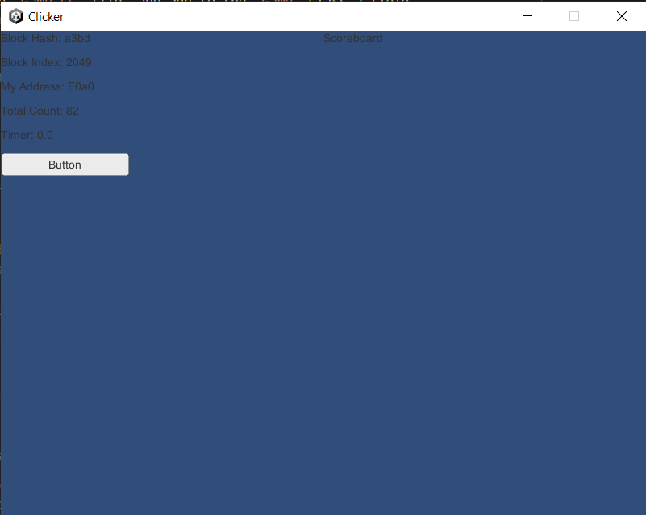
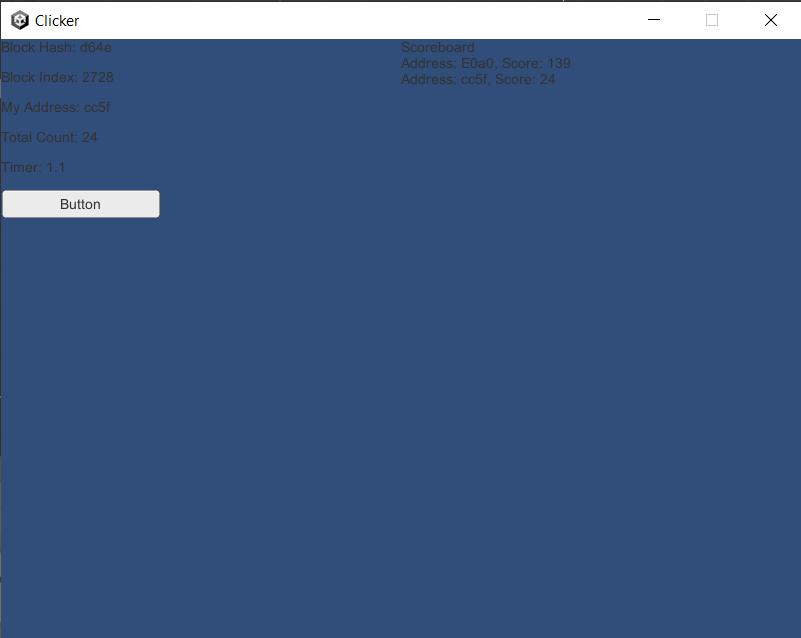

# Scoreboard

So far, all we have done is write an encoded `int` value to some `Address`,
namely the user's `Address`, on a blockchain.  As a node only knows about
its own `Address`, if we would want to see the states stored at some other
node's `Address`, we need to keep track of it somehow.  Although
every blockchain keeps a complete historical data, scouring the entire
blockchain would be very inefficient.  Hence, in this section, we create
a scoreboard where it keeps track of all `Address`es that have
interacted with an application by creating `ClickAction` action and had
it added to the blockchain.


## Scoreboard UI

As it is not the intention of this tutorial to teach ins and outs of [Unity],
we will be using a simple text box for a scoreboard.

- Inside the **Hierarchy** panel, right click on `Interface` and select
  `UI` → `Legacy` → `Text` and name it `ScoreBoard`.
- Drag the `ScoreBoard` element inside the **Scene** panel to an empty
  area and resize it to take up a sizable part of the screen.

Open up the `Game.cs` file, and add to the `Game` class a field
named `ScoreBoardText`:

```csharp
public Text ScoreBoardText;
```

Also add a placeholder initial text assignment inside the `Start()` method:

```csharp
ScoreBoardText.text = "Scoreboard";
```

Just like before, drag and drop `ScoreBoard` text element from
the **Hierarchy** panel to the `GameObject`'s **Inspector** panel accordingly.

Once again, build and run to see if the text `Scoreboard` shows up on screen.




## States and Actions for `ScoreBoard`

To store scoreboard information, we need to create a new state class.
Create a file named `ScoreBoardState.cs` under `Assets/Scripts/States/`
with the following content:

```csharp
using System.Collections.Immutable;
using Libplanet;
using Libplanet.Store;

namespace Scripts.States
{
    public class ScoreBoardState : DataModel
    {
        // Fields are ignored when encoding.
        // As ranking board itself is not tied to a specific account,
        // a hardcoded address to store the state is required.
        public static readonly Address Address = new Address(
            new byte[]
            {
                0x0, 0x0, 0x0, 0x0, 0x0, 0x0, 0x0, 0x0, 0x0, 0x0,
                0x0, 0x0, 0x0, 0x0, 0x0, 0x0, 0x0, 0x0, 0x0, 0x1,
            });

        // To enforce a state change.  As this class only tracks addresses,
        // changes in scores stored somewhere else do not necessarily affect the list
        // of participants below.
        public long Nonce { get; private set; }

        // The list of addresses that have changed its count at some point.
        public ImmutableList<Address> Participants { get; private set; }

        public ScoreBoardState()
            : base()
        {
            Nonce = 0L;
            Participants = ImmutableList<Address>.Empty;
        }

        public ScoreBoardState(long nonce, ImmutableList<Address> participants)
        {
            Nonce = nonce;
            Participants = participants;
        }

        // Used for deserializing a stored state.
        // This must be declared as base constructor cannot be inherited.
        public ScoreBoardState(Bencodex.Types.Dictionary encoded)
            : base(encoded)
        {
        }

        public ScoreBoardState UpdateScoreBoard(Address account)
        {
            return Participants.Contains(account)
                ? new ScoreBoardState(Nonce + 1, Participants)
                : new ScoreBoardState(Nonce + 1, Participants.Add(account));
        }
    }
}
```

Although it would be possible to keep track of the score for each address
at `ScoreBoardState.Address`, this is duplicate information.  Obviously, there
are some pros and cons of doing it either way.

As for implementing an action for a scoreboard, as a scoreboard object
is not an active user per se, but only a simple tracker, it does not make
much sense to have its own `IAction` to change its own state as `IAction`s are
meant to be recorded on a blockchain.  We make changes to `ClickAction` action
so that when executed, it reports to the shared `ScoreBoardState` at
`ScoreBoardState.Address`.  Open up `ClickAction.cs` and update the `Execute()`
method as follows:

```csharp
// Executes an action.
// This is what gets called when a block containing an action is mined
// or appended to a blockchain.
public override IAccountStateDelta Execute(IActionContext context)
{
    // Retrieves the previously stored state.
    IAccountStateDelta states = context.PreviousStates;
    CountState countState =
        states.GetState(context.Signer) is Bencodex.Types.Dictionary countStateEncoded
            ? new CountState(countStateEncoded)
            : new CountState(0L);

    // Mutates the loaded state, logs the result, and stores the resulting state.
    long prevCount = countState.Count;
    countState = countState.AddCount(_plainValue.Count);
    long nextCount = countState.Count;
    Debug.Log($"click_action: PrevCount: {prevCount}, NextCount: {nextCount}");

    // Also update the scoreboard.
    ScoreBoardState scoreBoardState =
        states.GetState(ScoreBoardState.Address) is Bencodex.Types.Dictionary scoreBoardStateEncoded
            ? new ScoreBoardState(scoreBoardStateEncoded)
            : new ScoreBoardState();
    scoreBoardState = scoreBoardState.UpdateScoreBoard(context.Signer);

    return states
        .SetState(ScoreBoardState.Address, scoreBoardState.Encode())
        .SetState(context.Signer, countState.Encode());
}
```

Whenever a score is updated, i.e. `ClickAction.Execute()` is executed,
it "touches" the `ScoreBoardState` by increasing its nonce value.


## Updated `Game.cs` Script

Go back to `Game.cs` and update its content with the following:

```csharp
using System;
using System.Collections.Generic;
using System.Linq;
using Libplanet;
using Libplanet.Action;
using Libplanet.Blocks;
using Libplanet.Blockchain.Renderers;
using Libplanet.Unity;
using UnityEngine;
using UnityEngine.UI;
using UnityEngine.Events;
using Scripts.Actions;
using Scripts.States;

namespace Scripts
{
    // Unity event handlers.
    public class BlockUpdatedEvent : UnityEvent<Block<PolymorphicAction<ActionBase>>>
    {
    }

    public class TotalCountUpdatedEvent : UnityEvent<CountState>
    {
    }

    public class Game : MonoBehaviour
    {
        // Connected to UI elements.
        public Text BlockHashText;
        public Text BlockIndexText;
        public Text AddressText;
        public Text TotalCountText;
        public Text TimerText;
        public Text ScoreBoardText;
        public Click Click;

        private BlockUpdatedEvent _blockUpdatedEvent;
        private TotalCountUpdatedEvent _totalCountUpdatedEvent;
        private IEnumerable<IRenderer<PolymorphicAction<ActionBase>>> _renderers;
        private Agent _agent;
        private Timer _timer;

        // Unity MonoBehaviour Awake().
        public void Awake()
        {
            // General application settings.
            Screen.SetResolution(800, 600, FullScreenMode.Windowed);
            Application.SetStackTraceLogType(LogType.Log, StackTraceLogType.ScriptOnly);

            // Register listeners.
            _blockUpdatedEvent = new BlockUpdatedEvent();
            _blockUpdatedEvent.AddListener(UpdateBlockTexts);
            _blockUpdatedEvent.AddListener(UpdateScoreBoardText);
            _totalCountUpdatedEvent = new TotalCountUpdatedEvent();
            _totalCountUpdatedEvent.AddListener(UpdateTotalCountText);

            // Renderers are called when certain conditions are met.
            // There are different types of renderers called under different conditions.
            // Some are called when a new block is added, some are called when an action is executed.
            _renderers = new List<IRenderer<PolymorphicAction<ActionBase>>>()
            {
                new AnonymousRenderer<PolymorphicAction<ActionBase>>()
                {
                    BlockRenderer = (oldTip, newTip) =>
                    {
                        // FIXME: For a genesis block, this renderer can get called
                        // while Libplanet's internal BlockChain object is not
                        // fully initialized.  This is a haphazard way to bypass
                        // NullReferenceException getting thrown.
                        if (newTip.Index > 0)
                        {
                            _agent.RunOnMainThread(() => _blockUpdatedEvent.Invoke(newTip));
                        }
                    }
                },
                new AnonymousActionRenderer<PolymorphicAction<ActionBase>>()
                {
                    ActionRenderer = (action, context, nextStates) =>
                    {
                        // Invoke the event handler only if the state is updated.
                        if (nextStates.GetState(context.Signer) is Bencodex.Types.Dictionary bdict)
                        {
                            _agent.RunOnMainThread(() => _totalCountUpdatedEvent.Invoke(new CountState(bdict)));
                        }
                    }
                }
            };

            // Initialize a Libplanet Unity Agent.
            _agent = Agent.AddComponentTo(gameObject, _renderers);

            // Initialize a Timer.
            _timer = new Timer();
        }

        // Unity MonoBehaviour Start().
        public void Start()
        {
            // Initialize texts.
            BlockHashText.text = "Block Hash: 0000";
            BlockIndexText.text = "Block Index: 0";

            AddressText.text = $"My Address: {_agent.Address.ToHex().Substring(0, 4)}";
            Bencodex.Types.IValue initialState = _agent.GetState(_agent.Address);
            if (initialState is Bencodex.Types.Dictionary bdict)
            {
                _totalCountUpdatedEvent.Invoke(new CountState(bdict));
            }
            else
            {
                _totalCountUpdatedEvent.Invoke(new CountState(0L));
            }

            _timer.ResetTimer();
            TimerText.text = $"Timer: {_timer.Clock:F1}";

            ScoreBoardText.text = "Scoreboard";
        }

        // Unity MonoBehaviour FixedUpdate().
        public void FixedUpdate()
        {
            _timer.Tick();

            // If timer clock reaches zero, count the number of clicks so far
            // and create a transaction containing an action with the click count.
            // Afterwards, reset the timer and the count.
            if (_timer.Clock <= 0)
            {
                if (Click.Count > 0)
                {
                    List<PolymorphicAction<ActionBase>> actions =
                        new List<PolymorphicAction<ActionBase>>()
                        {
                            new ClickAction(Click.Count)
                        };
                    _agent.MakeTransaction(actions);
                }

                Click.ResetCount();
                _timer.ResetTimer();
            }

            TimerText.text = $"Timer: {_timer.Clock:F1}";
        }

        // Update block texts.
        private void UpdateBlockTexts(Block<PolymorphicAction<ActionBase>> tip)
        {
            BlockHashText.text = $"Block Hash: {tip.Hash.ToString().Substring(0, 4)}";
            BlockIndexText.text = $"Block Index: {tip.Index}";
        }

        // Update total count text.
        private void UpdateTotalCountText(CountState countState)
        {
            TotalCountText.text = $"Total Count: {countState.Count}";
        }

        // Update scoreboard text.
        private void UpdateScoreBoardText(Block<PolymorphicAction<ActionBase>> tip)
        {
            // Check for the scoreboard state.
            Bencodex.Types.IValue scoreBoardStateEncoded =
                _agent.GetState(ScoreBoardState.Address, tip.Hash);
            ScoreBoardState scoreBoardState =
                scoreBoardStateEncoded is Bencodex.Types.Dictionary bdict
                    ? new ScoreBoardState(bdict)
                    : new ScoreBoardState();

            // Look up and retrieve each score stored at each address.
            Dictionary<Address, long> scores = new Dictionary<Address, long>();
            foreach (Address account in scoreBoardState.Participants)
            {
                CountState countState =
                    _agent.GetState(account, tip.Hash)
                        is Bencodex.Types.Dictionary countStateEncoded
                            ? new CountState(countStateEncoded)
                            : throw new ArgumentException(
                                $"Invalid state found for account {account}");
                scores.Add(account, countState.Count);
            }

            // Format output text.
            if (scores.Count > 0)
            {
                string ToScoreText(Address address, long score)
                {
                    return $"Address: {address.ToHex().Substring(0, 4)}, Score: {score}";
                }

                ScoreBoardText.text = (
                    "Scoreboard" +
                    Environment.NewLine +
                    string.Join(
                        Environment.NewLine,
                        scores.Select(kv => ToScoreText(kv.Key, kv.Value))));
            }
            else
            {
                ScoreBoardText.text = "Scoreboard";
            }
        }
    }
}
```

Notable changes are as follows:

- Create a new method called `UpdateScoreBoardText()` to update the text.
- Add `UpdateScoreBoardText()` to `BlockUpdatedEvent` as a listener.

You might be wondering why `UpdateScoreBoardText()` is tied to
`BlockRenderer` and not to `ActionRenderer` above.  This is because
the context passed on by an `ActionRenderer` does not have a sufficient amount
of information to recursively search the internal state storage.  Note how
`tip.Hash` is used when searching for scores.  By design, due to how
an `IAction` is executed on a blockchain, this piece of information cannot be
retrieved at the time of execution of an `IAction`[^1].

Test by building and running again.  Even though you might have some click
counts already stored on your local chain, your `ScoreBoard` might show
nothing.  This is because it hasn't been created yet.  Once you click on
the button several more times and `ClickAction` action is executed,
you will see the click count reflected on the `ScoreBoard`.


## Testing with a different `Address`

To test this works with multiple `Address`es, exit the `Clicker` application,
select `Tools` → `Libplanet` → `Private key` → `Create private key`.  Confirm
to overwrite the original private key.  Backup if you would like to keep the
original private key, as it will be lost once overwritten.  Now run the
application again and start clicking.  You should notice that your address
has changed and the counter going up from zero again.  The old score tied
to the previous `Address` is still there, but a new score for the
new `Address` should also show up on `ScoreBoard`.




<!-- footnotes -->

----

### Footnotes

[^1]: The `Hash` of a `Block` is only determined after all `IAction`s in
      the `Block` are executed.


<!-- links -->

[Unity]: https://unity.com/
