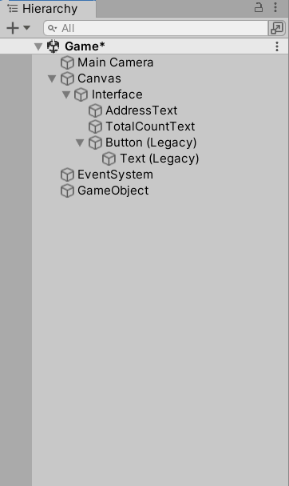
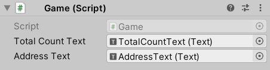

# Tutorial

## Overview

This tutorial will walk you through creating a basic blockchain application
called Clicker.  Users will be able to do the following:

- Run a local blockchain node.
- Create transactions containing `ClickAction` actions.
- Have blocks mined containing transactions, if any[^1].
- Have mined blocks added to the local blockchain.
- Update the UI counting the total number of clicks once `ClickAction` actions
  are evaluated by the local blockchain.


## Initial Setup

<!-- This subsection should be rewritten for importing an SDK package -->
### Development Environment Setup

To ease the initial setup process, such as packaging `dll` files etc.,
we will be using [this template][template] as a starting point.  You can
also check the finished sample project [here][sample].

First and foremost, install [Unity Hub] first[^2].  Once finished,
clone [this][template] repository using [git] to any location you like.

Open installed [Unity Hub] and from `Open` → `Add project from disk`,
select `Clicker` directory and select `Add project`.  Once `Clicker` project
is added to the list of projects, click on the project to open.  You will be
prompted to choose a Unity Editor version.  If you don't have Unity Editor
version 2021.3.0f1 already installed, install it first and select the version
from the list and press `Open with 2021.3.0f1`[^3].

### Blockchain Node Setup

In order to run a [Libplanet] blockchain node, the following three are needed:

- A genesis block: This is the very first block of a blockchain.  Only nodes
  with the same genesis block can properly communicate with each other.
- A swarm configuration: A `json` file that determines the behavior of a node,
  This is outside the scope of this tutorial.
- A private key: This determines the identity of a node.  All transactions
  created and all blocks mined will be signed using this private key.

These three files can be easily created using Unity Editor menu.  Create each
using `Create genesis block`, `Create swarm config`, and `Create private key`
under `Tools` → `Libplanet`.


## Basic UI

We will be creating an application with the following components:

- Text showing the player's address.
- Text showing the total number of registered clicks.
- A button to click.

### Creating a Scene

Perform the following step by step in Unity Editor:

- Create a new scene: Right click on `Assets/Scenes` directory in
  Unity Editor inside the **Project** panel and select `Create` → `Scene`
  and name it as `Game`.
  - Double click on the newly created scene `Game` to activate it.  Once
    activated, `Game` should show inside the **Hierarchy** panel.
  - Right click on `Directional Light` object under `Game` inside the Hierarchy
    panel and select `Delete` to remove it from the scene.
- Edit the main camera: Inside the **Hierarchy** panel, select `Main Camera`.
  - Inside the Scene panel, select `2D`.
  - Inside the **Inspector** panel, set `Clear Flags` to `Solid Color`,
    `Projection` to `Orthographic`, and `MSAA` to `Off`.
- Create a new canvas: Right click on `Game` inside the **Hierarchy** panel
  and select `GameObject` → `UI` → `Canvas`.
  - Select `Canvas` inside the **Hierarchy** panel
  - Inside the **Inspector** panel, set `Render Mode` to `Screen Space - Camera`,
    drag and drop `Main Camera` from the **Hierarchy** panel to the box next to
    `Render Camera`, and set `UI Scale Mode` to `Scale With Screen Size`.
  - Right click on `Canvas` inside the **Hierarchy** panel and select `Properties`.
    Select `Add Component` from the properties window and select
    `Horizontal Layout Group`.
- Create an interface: Right click on `Canvas` inside the **Hierarchy** panel
  and select `Create Empty` to create a `GameObject`.  Rename the newly created
  `GameObject` as `Interface`.
  - Right click on `Interface` and select `UI` → `Legacy` → `Text` twice
    to create two `Text` objects.  Name them as `AddressText`
    and `TotalCountText`.
  - Again, right click on `Canvas` inside the **Hierarchy** panel and
    select `UI` → `Legacy` → `Button` to create a button.
  - Drag objects around inside the scene panel so they do not overlap.
- Create a game object: Right click on `Game` inside the **Hierarchy** panel
  and select `Create Empty` to create a `GameObject`.

When finished, the **Hierarchy** panel should look something like below.



### Initial Script for UI

Create a file named `Click.cs` under `Assets/Scripts` with
the following content.

```csharp
using UnityEngine;

namespace Scripts
{
    public class Click : MonoBehaviour
    {
        public int Count { get; set; } = 0;

        public void Add()
        {
            Count++;
        }

        public void ResetCount()
        {
            Count = 0;
        }
    }
}
```

Also create a file named `Game.cs` under `Assets/Scripts` with
the following content.

```csharp
using UnityEngine;
using UnityEngine.UI;

namespace Scripts
{
    public class Game : MonoBehaviour
    {
        public Text TotalCountText;
        public Text AddressText;
        public Click Click;

        public void Awake()
        {
            TotalCountText.text = "Total Count: 0";
            AddressText.text = "Address: 0000";
        }
    }
}
```

Now we connect the scripts above to the UI using the following steps:

- Select `Button` from the **Hierarchy** panel.  Inside the **Inspector** panel,
  select `Add Component` → `Scripts` → `Scripts` → `Click` to register
  `Click.cs` to the button.
  - There should be an `On Click ()` field inside the **Inspector** panel.
  - Select `+` to add to the list.  Then drag and drop `Button` object
    from the **Hierarchy** panel to the newly created element under `On Click ()`.
  - Change `No Function` to `Click` → `Add ()`.
- Select `GameObject` from the **Hierarchy** panel.  Inside the **Inspector**
  panel, select `Add Component` → `Scripts` → `Scripts` → `Game`.
  - Inside the **Inspector** panel, under `Game` component, you should see
    `Total Account Text`, `Address Text`, and `Click`; drag and drop objects
    from the **Hierarchy** panel to each corresponding box accordingly.

When done, the **Inspector** panel for `GameObject` should look like below.



Try build and run.  If everything was done accordingly, you should see
`Total Count: 0` and `Address: 0000` on your screen.

## Actions and States

Three componenets are needed to create an action for a [Libplanet] blockchain
to consume:

- Action itself.
- Arguments for an action.  This is stored on **Blockchain** store.
- Output for an action.  This is stored on **State** store.

An action is any [C#] object implementing an `IAction` interface.
Since we can't directly record a [C#] object to a blockchain,
when we say an action is recorded on a blockchain, what it technically means
is its arguments, together with its name to identify which action took place,
is written.

As a result of executing an action, i.e. being recorded on a blockchain,
changes the game state by writing the output of the action to a stored state.

In both cases, data is encoded in [Bencodex] format.

### State `CountState`

In order to store the total number of clicks for a player, we essentially
wrap `long` inside a class called `CountState` that inherits `DataModel`.
Create a new file named `CountState.cs` under `Assets/Scripts/States/`
with the following content.

```csharp
using Libplanet.Store;

namespace Scripts.States
{
    public class CountState : DataModel
    {
        public long Count { get; private set; }

        // Used for creating a new state.
        public CountState(long count)
            : base()
        {
            Count = count;
        }

        // Used for deserializing a stored state.
        // This must be declared as base constructor cannot be inherited.
        public CountState(Bencodex.Types.Dictionary encoded)
            : base(encoded)
        {
        }

        // Used for adding `count` to the current state.
        public void AddCount(long count)
        {
            Count = Count + count;
        }
    }
}
```

As all data recorded on blockchain and the state storage in [Bencodex] format,
the `DataModel` class is there to help with all the heavy lifting of encoding
and decoding behind the scenes.

### Plain value `ClickActionPlainValue`

In order to store the number of clicks for an action, its arguments should also
be encoded in [Bencodex] format.  For this purpose, similar to `CountState`,
we need to wrap `long` inside a class called `ClickActionPlainValue`.
Create a new file named `ClickActionPlainValue.cs` under
`Assets/Scripts/Actions/` with the following content.

```csharp
using Libplanet.Store;

namespace Scripts.Actions
{
    public class ClickActionPlainValue : DataModel
    {
        public long Count { get; private set; }

        public ClickActionPlainValue(long count)
            : base()
        {
            Count = count;
        }

        // Used for deserializing stored action.
        public ClickActionPlainValue(Bencodex.Types.Dictionary encoded)
            : base(encoded)
        {
        }
    }
}
```

Although there doesn't seem to be much of a difference between `CountState`
and `ClickActionPlainValue` classes, the two have completely different
uses and it is **highly advisable** to have these to be separate.

### Action `ClickAction`

Now create a file named `ClickAction.cs` under `Assets/Scripts/Actions`
with the following content for `ClickAction` action.

```csharp
using System;
using Libplanet.Action;
using Libplanet.Unity;
using Scripts.States;
using UnityEngine;

namespace Scripts.Actions
{
    // Used for reflection when deserializing a stored action.
    [ActionType("click_action")]
    public class ClickAction : ActionBase
    {
        private ClickActionPlainValue _plainValue;

        // Used for reflection when deserializing a stored action.
        public ClickAction()
        {
        }

        // Used for creating a new action.
        public ClickAction(long count)
        {
            _plainValue = new ClickActionPlainValue(count);
        }

        // Used for serialzing an action.
        public override Bencodex.Types.IValue PlainValue => _plainValue.Encode();

        // Used for deserializing a stored action.
        public override void LoadPlainValue(Bencodex.Types.IValue plainValue)
        {
            if (plainValue is Bencodex.Types.Dictionary bdict)
            {
                _plainValue = new ClickActionPlainValue(bdict);
            }
            else
            {
                throw new ArgumentException(
                    $"Invalid {nameof(plainValue)} type: {plainValue.GetType()}");
            }
        }

        // Executes an action.
        // This is what gets called when a block containing an action is mined
        // or appended to a blockchain.
        public override IAccountStateDelta Execute(IActionContext context)
        {
            // Retrieves the previously stored state.
            IAccountStateDelta states = context.PreviousStates;
            CountState countState =
                states.GetState(context.Signer) is Bencodex.Types.Dictionary countStateEncoded
                    ? new CountState(countStateEncoded)
                    : new CountState(0L);

            // Mutates the loaded state, logs the result, and stores the resulting state.
            long prevCount = countState.Count;
            countState.AddCount(_plainValue.Count);
            long nextCount = countState.Count;
            Debug.Log($"click_action: PrevCount: {prevCount}, NextCount: {nextCount}");
            return states.SetState(context.Signer, countState.Encode());
        }
    }
}
```

As can be seen in the comments above, most of the code above is to automate
serialization and deserialization.  Pay special attention to the `Execute()`
method where the main logic of the action resides.


## Script `Game.cs`

```csharp
using System.Collections.Generic;
using Libplanet.Action;
using Libplanet.Blockchain.Renderers;
using Libplanet.Unity;
using Scripts.Actions;
using Scripts.States;
using UnityEngine;
using UnityEngine.UI;
using UnityEngine.Events;

namespace Scripts
{
    // Unity event handler.
    public class CountUpdatedEvent : UnityEvent<CountState>
    {
    }

    public class Game : MonoBehaviour
    {
        // Determines how often clicks are collected.
        public const float TxProcessInterval = 3.0f;

        // Connected to UI elements.
        public Text TotalCountText;
        public Text AddressText;
        public Click Click;

        // Internal timer.
        private float _timer;

        private CountUpdatedEvent _countUpdatedEvent;
        private IEnumerable<IRenderer<PolymorphicAction<ActionBase>>> _renderers;
        private Agent _agent;

        // Unity MonoBehaviour Awake().
        public void Awake()
        {
            // General application settings.
            Screen.SetResolution(800, 600, FullScreenMode.Windowed);
            Application.SetStackTraceLogType(LogType.Log, StackTraceLogType.ScriptOnly);

            // Register a listener.
            _countUpdatedEvent = new CountUpdatedEvent();
            _countUpdatedEvent.AddListener(UpdateTotalCountText);

            // Renderers are called when certain conditions are met.
            // There are different types of renderers called under different conditions.
            // Some are called when a new block is added, some are called when an action is executed.
            _renderers = new List<IRenderer<PolymorphicAction<ActionBase>>>()
            {
                new AnonymousActionRenderer<PolymorphicAction<ActionBase>>()
                {
                    ActionRenderer = (action, context, nextStates) =>
                    {
                        // Invoke the event handler only if the state is updated.
                        if (nextStates.GetState(context.Signer) is Bencodex.Types.Dictionary bdict)
                        {
                            Agent.Instance.RunOnMainThread(() =>
                            {
                                _countUpdatedEvent.Invoke(new CountState(bdict));
                            });
                        }
                    }
                }
            };

            // Initialize a Libplanet Unity Agent.
            Agent.Initialize(_renderers);
            _agent = Agent.Instance;
        }

        // Unity MonoBehaviour Start().
        public void Start()
        {
            // Initialize the timer.
            _timer = TxProcessInterval;

            // Initialize texts.
            AddressText.text = $"My Address: {_agent.Address.ToHex().Substring(0, 4)}";
            Bencodex.Types.IValue initialState = _agent.GetState(Agent.Instance.Address);
            if (initialState is Bencodex.Types.Dictionary bdict)
            {
                _countUpdatedEvent.Invoke(new CountState(bdict));
            }
            else
            {
                _countUpdatedEvent.Invoke(new CountState(0L));
            }
        }

        // Unity MonoBehaviour FixedUpdate().
        public void FixedUpdate()
        {
            // If the timer has not reached zero, keep counting down.
            if (_timer > 0)
            {
                _timer -= Time.deltaTime;
            }
            // Else, count the number of clicks so far and create a transaction
            // containing an action with the click count.
            // Afterwards, resets the timer and the count.
            else
            {
                if (Click.Count > 0)
                {
                    List<ActionBase> actions = new List<ActionBase>()
                    {
                        new ClickAction(Click.Count)
                    };
                    Agent.Instance.MakeTransaction(actions);
                }

                _timer = TxProcessInterval;
                Click.ResetCount();
            }
        }

        // Updates total count text.
        private void UpdateTotalCountText(CountState countState)
        {
            TotalCountText.text = $"Total Count: {countState.Count}";
        }
    }
}
```

<!-- footnotes -->

----

### Footnotes

[^1]: Blocks will be mined regardless of whether there are any transactions
      to mine or not.

[^2]: This tutorial is written with [Unity Hub] 3.1.2.

[^3]: At this moment, only Unity Editor version 2021.3.0f1 is supported.

<!-- links -->

[Unity Hub]: https://unity3d.com/get-unity/download
[template]: https://github.com/planetarium/libplanet-unity-template
[sample]: https://github.com/planetarium/planet-clicker/tree/sample
[git]: https://git-scm.com/
[Libplanet]: https://github.com/planetarium/libplanet
[C#]: https://docs.microsoft.com/en-us/dotnet/csharp
[Bencodex]: https://github.com/planetarium/bencodex
